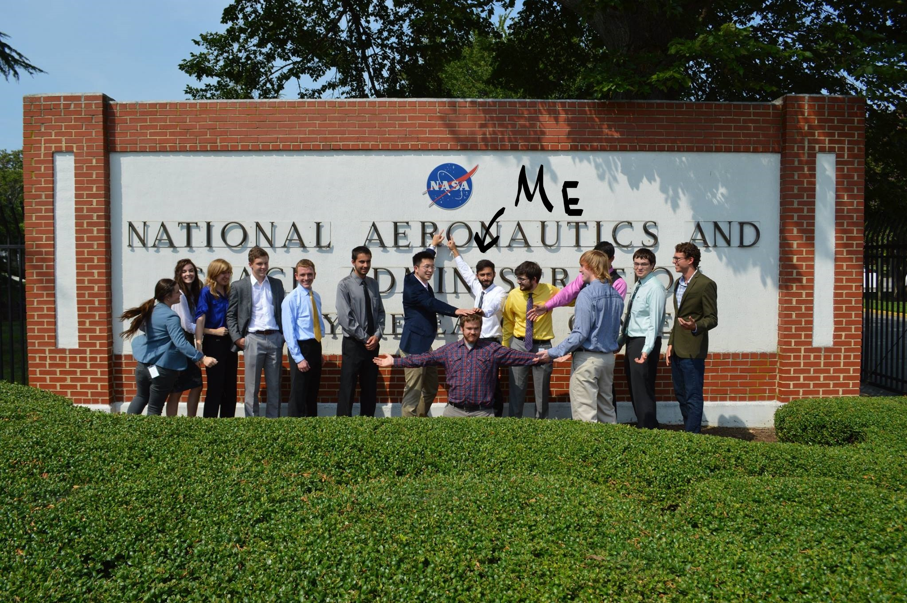

# High Temperature 3D Printing (with nanotubes!)
## Space printer, LESLIE, it had many names and only caught on fire once.

This project was a part of an internship at NASA Langley which spanned over two consecutive summers.

We built:

1. A low-cost high temperature 3D printing platform using (modified) open-source components from the LulzBot series of printers.
[Here is a whitepaper documenting this work!](https://ntrs.nasa.gov/archive/nasa/casi.ntrs.nasa.gov/20170000214.pdf)

2. A large-format 3D printer with two gantries and six unique toolheads, one that stitches carbon nanotube yarn.

Here's a picture of me and my team:

