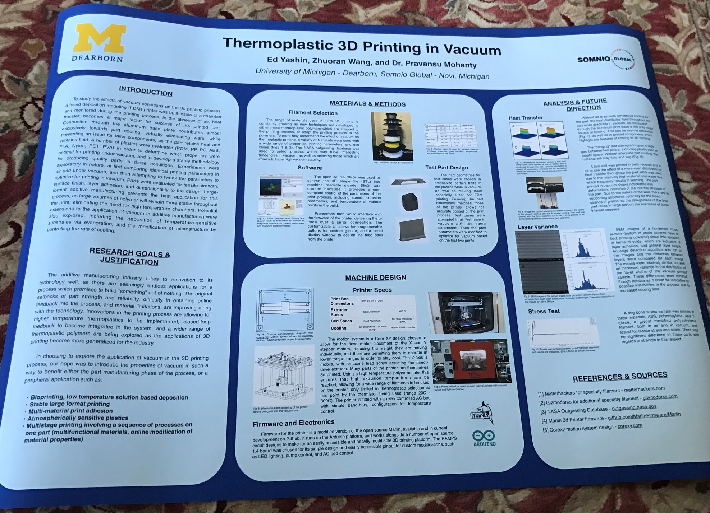

# 3D Printer in a Vaccuum
## Senior research project to emulate space environments for 3D printing.

Have you ever wondered what happens when you put a thermoplastic 3D printer under high vacuum?

Me too. So I proposed an independent study be done about it.

After a few months of research and a presentation at AeroDef in Fort Worth, Texas:

We found that it was just really tough to cool things down.

Here is a look at the unique water cooled extruder designed for the printer (if that doesn't look like undergraduate University funding, I don't know what does!)

Here is the poster presented:
